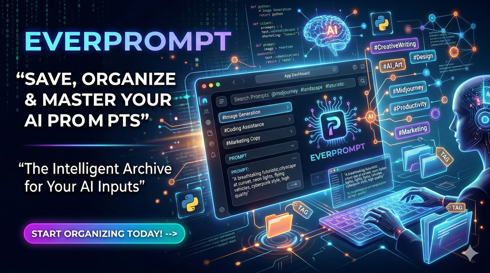
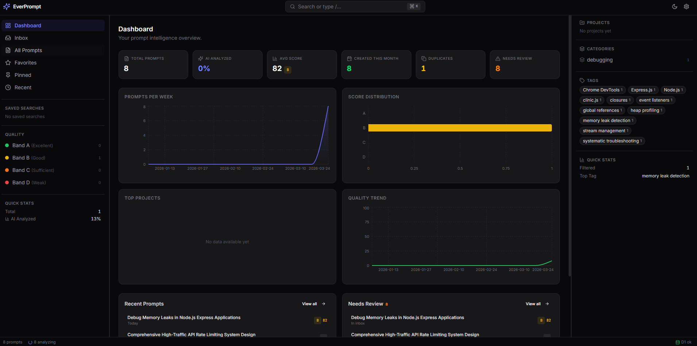
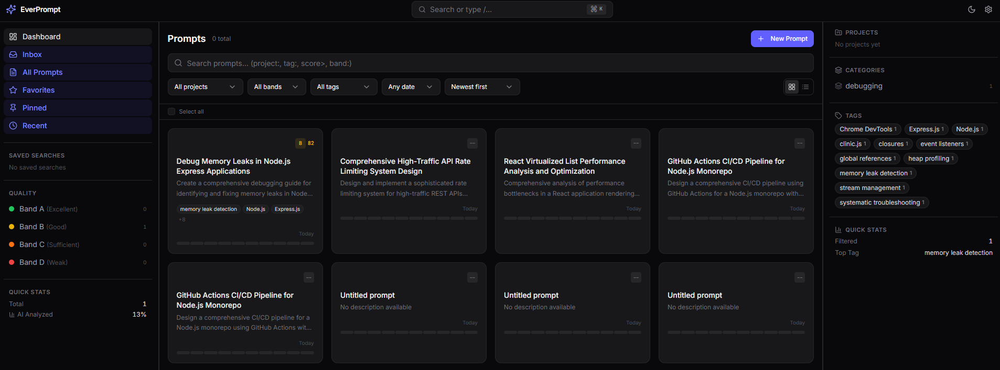
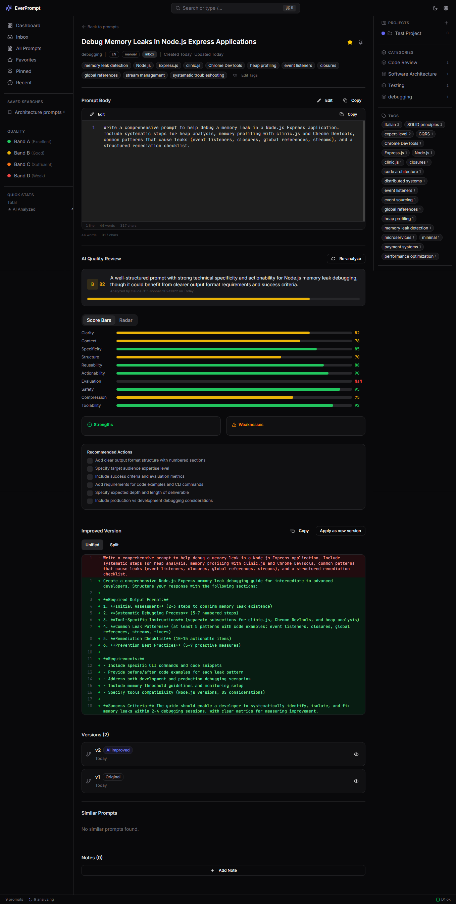
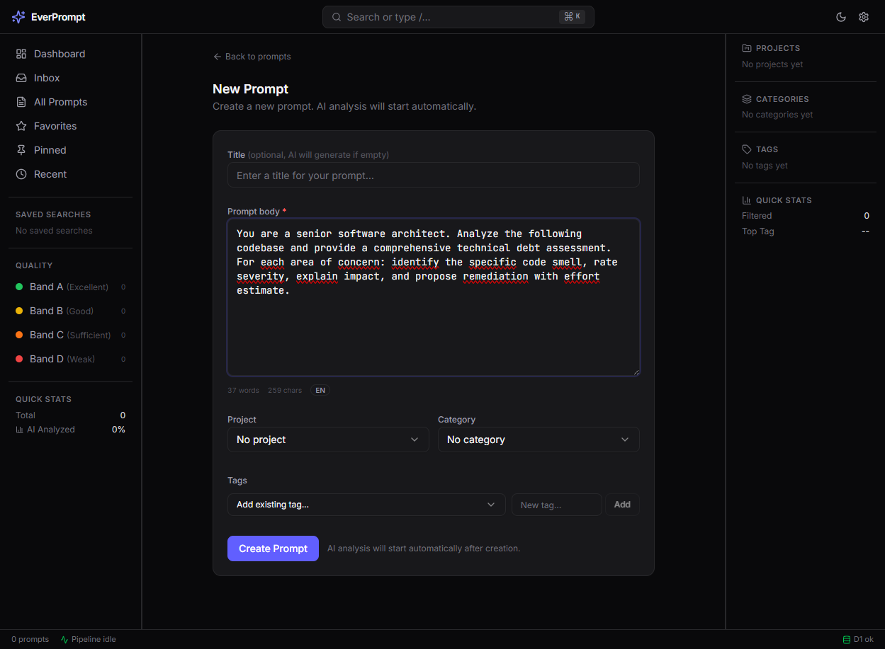
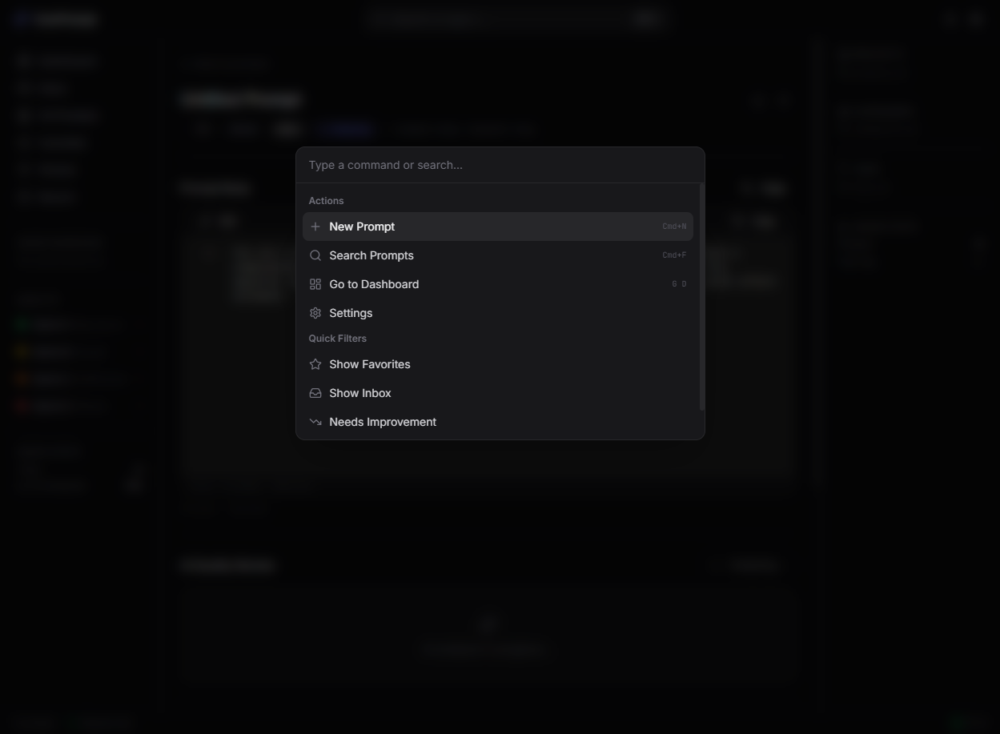
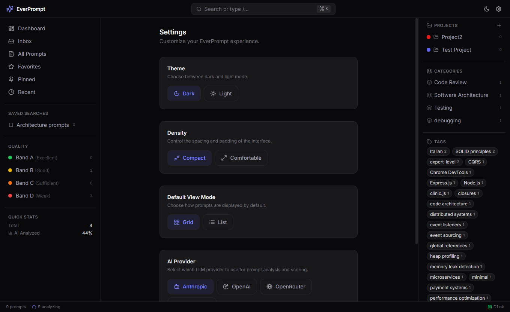

<p align="center">
  
</p>

<h1 align="center">EverPrompt</h1>
<p align="center"><strong>Prompt Intelligence System</strong></p>
<p align="center"><em>Your prompts, forever better.</em></p>

<p align="center">
  
  
  
  
  
  
</p>

---

## What is EverPrompt?

EverPrompt transforms every prompt you write into a **versioned, scored, improvable, and semantically searchable asset**. It's not a notes app with AI bolted on -- it's a purpose-built **Prompt Intelligence System** with three souls:

1. **Intelligent Archive** -- Store, organize, and version every prompt across projects, categories, and tags
2. **AI Critic** -- Automatically score prompts on 10 quality dimensions, provide detailed judgment, and generate improved versions
3. **Semantic Retrieval Engine** -- Find prompts by meaning (not just keywords) using hybrid search: structured filters + full-text + vector similarity

The entire stack runs on Cloudflare's edge infrastructure: Workers, D1, Vectorize, Queues, R2, KV. The AI pipeline supports **4 LLM providers** (Anthropic, OpenAI, OpenRouter, Workers AI) configurable at runtime.

---

## Table of Contents

- [Features](#features)
- [Screenshots](#screenshots)
- [Tech Stack](#tech-stack)
- [Prerequisites](#prerequisites)
- [Quick Start (Local Development)](#quick-start-local-development)
- [LLM Provider Configuration](#llm-provider-configuration)
- [Project Structure](#project-structure)
- [Development Guide](#development-guide)
- [Deployment to Cloudflare](#deployment-to-cloudflare)
- [Claude CLI Plugin Setup](#claude-cli-plugin-setup)
- [Environment Variables](#environment-variables)
- [API Reference](#api-reference)
- [Architecture](#architecture)
- [Troubleshooting](#troubleshooting)
- [License](#license)

---

## Features

### AI Pipeline (Automatic)

Every prompt you save triggers an asynchronous AI analysis pipeline:

- **Auto-title** -- Generates a concise 5-10 word title
- **Auto-abstract** -- 1-2 sentence summary of the prompt's purpose
- **Auto-categorization** -- Suggests a category based on content
- **Auto-tagging** -- Generates tags with confidence scores across 8 kinds: topic, model, tone, task, quality, domain, language, technique
- **Intent detection** -- Classifies as code_generation, analysis, writing, brainstorming, debugging, planning, or other
- **Complexity assessment** -- Rates as simple, moderate, complex, or expert

### 10-Dimension Quality Scoring

Each prompt is scored on 10 dimensions (0-100):

| Dimension | Weight | What it measures |
|-----------|--------|-----------------|
| Clarity | 15% | Readable, linear, unambiguous |
| Context | 12% | Enough context, constraints, domain, objective |
| Specificity | 13% | Says exactly what it wants |
| Structure | 10% | Sections, bullets, input/output, examples |
| Reusability | 8% | Reusable or single-use |
| Actionability | 15% | Enables model to produce actionable output |
| Evaluation | 10% | Defines success/verification criteria |
| Safety | 5% | Avoids problematic or uncontrollable requests |
| Compression | 5% | Dense vs unnecessarily verbose |
| Toolability | 7% | Ready for tools, data, structured inputs |

Results in an **overall score** (weighted average) and **quality band**:
- **A** (85-100): Excellent, ready for direct use
- **B** (70-84): Good, improvable in specific areas
- **C** (50-69): Sufficient, needs revision
- **D** (0-49): Weak, rewrite recommended

Each review includes: **verdict** (1 sentence), **strengths**, **weaknesses**, **recommended actions** (checklist), and a **complete improved version** of the prompt.

### Multi-Provider LLM Support

Switch between AI providers from the Settings page or via API:

| Provider | Classify Model | Score Model | Auth | Cost |
|----------|---------------|-------------|------|------|
| **Anthropic** (default) | claude-haiku-4-5 | claude-sonnet-4 | `CLAUDE_API_KEY` | ~$0.003/prompt |
| **OpenAI** | gpt-4o-mini | gpt-4o | `OPENAI_API_KEY` | ~$0.01/prompt |
| **OpenRouter** | claude-3.5-haiku | claude-sonnet-4 | `OPENROUTER_API_KEY` | Varies |
| **Workers AI** | llama-3.1-8b | llama-3.1-70b | Free (CF AI binding) | Free |

### Hybrid Search

Three layers combined with weighted scoring:

1. **Structured filters** (D1 SQL) -- project, category, tags (AND/OR), status, quality band, score range, dates, flags
2. **Full-text keyword** (D1 LIKE) -- search across title, abstract, body, tag names
3. **Semantic search** (Vectorize) -- find prompts by meaning using 768-dim embeddings

**Query DSL** operators in the search box:

```
project:backend tag:architecture score>75 created:last30d microservices scalabili
```

| Operator | Example | Meaning |
|----------|---------|---------|
| `project:` | `project:backend` | Filter by project |
| `tag:` | `tag:architecture` | Filter by tag |
| `cat:` | `cat:engineering` | Filter by category |
| `score>` `score<` | `score>80` | Score range |
| `band:` | `band:A` | Quality band |
| `lang:` | `lang:it` | Language |
| `source:` | `source:plugin` | Source |
| `is:` | `is:favorite` | Flag filter |
| `has:` | `has:improved` | Has improved version |
| `created:` | `created:last30d` | Date range |

### Dashboard & Analytics

- **6 KPI cards**: Total prompts, AI analyzed %, average score, created this month, duplicates, needs review
- **4 charts** (Recharts): Creation per week (area), score distribution (bar), top projects (horizontal bar), quality trend (line)
- **Widgets**: Recent prompts, needs review (inbox + failed + low-score)

### Prompt Detail View

- Prompt body in code editor (Monaco) with line numbers, edit toggle, copy button
- AI Quality Review: overall bar + band badge, 10 dimension animated bars, verdict, strengths/weaknesses, recommended actions checklist
- Improved Version: diff viewer (unified/split), copy, apply as new version, re-generate
- Version history with kind labels (original, edited, improved_ai)
- Similar prompts via Vectorize (top 10 with similarity %)
- Notes (add, edit, delete)

### Organization

- **Projects** -- group prompts by project with color and icon
- **Categories** -- hierarchical tree with parent/child relationships
- **Tags** -- 8 kinds (topic, model, tone, task, quality, domain, language, technique), AI-generated or manual, with usage counts
- **Saved Searches** -- save query + filters + sort as named views, pinnable in sidebar

### Bulk Operations

Select multiple prompts and apply actions:
- Tag (add/remove)
- Move (change project/category)
- Favorite / Archive
- Re-analyze (re-run AI pipeline)
- Delete (with type-to-confirm safety dialog)

### UI/UX

- **Dark-first design** inspired by Linear + Notion + Raycast
- **3-panel layout**: resizable sidebars (left: navigation, right: browse/facets) with center content
- **Grid/List view** toggle for prompt cards
- **Command palette** (Cmd+K / Ctrl+K) for quick navigation and actions
- **Keyboard shortcuts**: J/K navigation, S=star, P=pin, E=edit, G+D=dashboard, and more
- **Framer Motion animations**: hover lift on cards, spring modals, staggered score bars, slide-up bulk bar
- **Dark/Light theme** with toggle
- **Compact/Comfortable density** toggle
- **Sonner toast notifications**
- **Status bar**: prompt count, pipeline status, D1 health

### Session Tracking (Claude CLI)

- Prompts captured from Claude CLI are automatically grouped by session
- Session names auto-generated by AI from the first prompt's content
- Sessions page in sidebar to browse and filter by session
- Session link shown in prompt detail view

### Security Scanner

- Automatic PII/credential detection on every prompt
- 60+ built-in regex patterns covering:
  - AI/LLM keys (Anthropic, OpenAI, OpenRouter, Cohere)
  - Cloud providers (AWS, Google Cloud, Azure)
  - Git platforms (GitHub, GitLab tokens)
  - Payment (Stripe, Square, credit cards)
  - Communication (Slack, Discord webhooks)
  - Database connection strings (MongoDB, PostgreSQL, MySQL, Redis)
  - Cryptographic material (private keys, certificates, JWTs)
  - SaaS platforms (SendGrid, Twilio, Vercel, Netlify, DigitalOcean, Heroku, npm, PyPI)
  - Infrastructure (Docker, Kubernetes credentials)
  - PII (SSN, IBAN, Italian Codice Fiscale)
  - Passwords and secrets in config/env files
- Custom regex patterns configurable via Settings
- **Privacy-first architecture**: security scan runs **before** any AI analysis. Detected secrets are redacted with `***` in the stored body, so sensitive data is **never sent to external AI providers** (Anthropic, OpenAI, etc.). The original prompt is preserved but the AI only ever sees the redacted version.
- Security issues highlighted in prompt detail with severity badges
- Red shield icon on cards/rows for flagged prompts
- Dedicated "Security Issues" filter in sidebar with count badge
- Matched secrets are partially redacted in the UI (e.g., `sk-an***..***f4aTw`) for safe viewing

### Data Retention / Auto-Prune

- Configurable auto-deletion of prompts older than N days (default: 6 months)
- Tag-based exclusions: prompts with specified tags are never auto-deleted
- Favorited and pinned prompts are always protected
- Daily scheduled run via Cloudflare Cron Triggers
- Preview before pruning: see exactly what would be deleted
- Manual prune trigger available

### Claude CLI Plugin

Automatically capture prompts from Claude CLI to your EverPrompt inbox:
- `user-prompt-submit` hook fires on every prompt
- Fire-and-forget: never blocks your prompt
- Configurable min length, exclude patterns, default project
- API key authentication

---

## Screenshots

### Dashboard

<p align="center">
<em>Dashboard with KPI cards, creation charts, score distribution, and widgets</em><br>
<em>Dashboard reflecting real prompt data: 2 prompts, creation trend, needs review</em>
</p>

### Dashboard with Data


### Prompts List
<p align="center"><em>Prompt grid with search bar (DSL operators), filter dropdowns, and card view</em></p>

### Prompt Detail

<p align="center"><em>Full detail view: Monaco editor, metadata badges, AI Quality Review, versions, notes</em></p>

### New Prompt

<p align="center"><em>Create prompt with body, word/char count, language detection, project/category/tags</em></p>

### Command Palette

<p align="center"><em>Cmd+K command palette: actions, quick filters, keyboard shortcuts</em></p>

### Settings

<p align="center"><em>Settings: theme, density, view mode, and AI provider selection</em></p>

---

## Tech Stack

| Layer | Technology | Role |
|-------|-----------|-------|
| Frontend | React 19 + TypeScript + Vite 6 | SPA |
| Routing | React Router v7 | Client-side routing |
| State | Zustand 5 (UI) + TanStack Query v5 (server) | State management |
| UI Kit | shadcn/ui + Radix + Tailwind CSS v4 | Component system |
| Animations | Framer Motion | Micro-interactions, transitions |
| Charts | Recharts | Dashboard metrics |
| Editor | Monaco Editor | Prompt body editing |
| Command | cmdk | Command palette |
| Notifications | Sonner | Toast system |
| Icons | Lucide React | Consistent iconography |
| Backend | Hono + Zod | API framework + validation |
| ORM | Drizzle ORM | Type-safe SQL |
| Runtime (prod) | Cloudflare Workers | Edge compute |
| Runtime (dev) | Bun | Dev server + tooling |
| Build | Turborepo | Monorepo orchestration |
| DB | Cloudflare D1 (SQLite) | Source of truth |
| Search | Cloudflare Vectorize | Semantic search (768-dim vectors) |
| Embeddings | Workers AI (`bge-base-en-v1.5`) | Vector generation |
| AI Analysis | Multi-provider (Anthropic/OpenAI/OpenRouter/Workers AI) | Scoring, judgment, improvement |
| Object Store | Cloudflare R2 | Attachments, exports |
| Cache | Cloudflare KV | Cache facets, dashboard stats |
| Queue | Cloudflare Queues | Async AI pipeline |
| Auth | Cloudflare Zero Trust | Access protection |
| Plugin | Claude CLI Plugin (hook) | Prompt capture |

---

## Prerequisites

| Tool | Minimum Version | Install |
|------|----------------|---------|
| **Bun** | >= 1.1 | `curl -fsSL https://bun.sh/install \| bash` |
| **Node.js** | >= 20 | [nodejs.org](https://nodejs.org) (needed for wrangler) |
| **Git** | any | [git-scm.com](https://git-scm.com) |
| **Cloudflare account** | free plan works | [dash.cloudflare.com/sign-up](https://dash.cloudflare.com/sign-up) |

**At least one LLM API key** (choose one):
| Provider | Get API key at |
|----------|---------------|
| **Anthropic** (recommended) | [console.anthropic.com](https://console.anthropic.com) -- $5 free credits |
| **OpenAI** | [platform.openai.com/api-keys](https://platform.openai.com/api-keys) |
| **OpenRouter** | [openrouter.ai/keys](https://openrouter.ai/keys) |
| **Workers AI** | No key needed -- free with CF account |

Verify:
```bash
bun --version    # 1.1+
node --version   # v20+
```

---

## Quick Start (Local Development)

### 1. Clone and install

```bash
git clone <your-repo-url>
cd everprompt
bun install
```

### 2. Run database migrations

```bash
bun run db:migrate
```

Expected output:
```
Migrations to be applied:
+------+-------------------------+--------+
| 0000_daily_hairball.sql | Applied        |
+------+-------------------------+--------+
```

### 3. Set up environment variables

```bash
cp .dev.vars.example .dev.vars
```

Edit `.dev.vars` with your API key(s):

```bash
# Required: at least one LLM key (or use Workers AI for free)
CLAUDE_API_KEY=sk-ant-api03-your-key-here
OPENAI_API_KEY=
OPENROUTER_API_KEY=
ENVIRONMENT=development
```

### 4. Start development servers

```bash
bun run dev
```

This starts both services in parallel via Turborepo:
- **API** (Cloudflare Worker): `http://localhost:8787`
- **Frontend** (Vite): `http://localhost:5173`

Open `http://localhost:5173` in your browser.

### 5. (Optional) Seed with demo data

```bash
bun run db:seed
```

Creates 3 projects, 5 categories, 10 tags, and 20 sample prompts.

---

## LLM Provider Configuration

### Switching providers via Settings UI

Go to **Settings** in the app and select your preferred AI provider. The classify and score models are automatically set to the best defaults for each provider.

### Switching providers via API

```bash
# Switch to OpenAI
curl -X PATCH http://localhost:8787/api/v1/settings \
  -H "Content-Type: application/json" \
  -d '{"ai_provider":"openai","ai_classify_model":"gpt-4o-mini","ai_score_model":"gpt-4o"}'

# Switch to Workers AI (free)
curl -X PATCH http://localhost:8787/api/v1/settings \
  -H "Content-Type: application/json" \
  -d '{"ai_provider":"workers-ai"}'

# Switch back to Anthropic
curl -X PATCH http://localhost:8787/api/v1/settings \
  -H "Content-Type: application/json" \
  -d '{"ai_provider":"anthropic"}'

# Use a custom model
curl -X PATCH http://localhost:8787/api/v1/settings \
  -H "Content-Type: application/json" \
  -d '{"ai_provider":"openrouter","ai_classify_model":"anthropic/claude-3.5-haiku","ai_score_model":"anthropic/claude-sonnet-4"}'
```

### Default models per provider

| Provider | Classify (fast, cheap) | Score (powerful) |
|----------|----------------------|------------------|
| `anthropic` | `claude-haiku-4-5-20251001` | `claude-sonnet-4-20250514` |
| `openai` | `gpt-4o-mini` | `gpt-4o` |
| `openrouter` | `anthropic/claude-3.5-haiku` | `anthropic/claude-sonnet-4` |
| `workers-ai` | `@cf/meta/llama-3.1-8b-instruct` | `@cf/meta/llama-3.1-70b-instruct` |

### API keys in environment

Set API keys in `.dev.vars` (local) or via `wrangler secret put` (production):

```bash
# .dev.vars (local development)
CLAUDE_API_KEY=sk-ant-api03-xxxxx      # For Anthropic
OPENAI_API_KEY=sk-xxxxx                # For OpenAI
OPENROUTER_API_KEY=sk-or-xxxxx         # For OpenRouter
# Workers AI needs no key -- uses CF AI binding

# Production
npx wrangler secret put CLAUDE_API_KEY
npx wrangler secret put OPENAI_API_KEY
npx wrangler secret put OPENROUTER_API_KEY
```

You only need the key for the provider you're using. Empty keys are fine for providers you don't use.

---

## Project Structure

```
everprompt/
  package.json                  Workspace root (Bun + Turborepo)
  turbo.json                    Turborepo task config
  tsconfig.base.json            Shared TypeScript config
  wrangler.jsonc                Cloudflare Workers bindings
  .dev.vars                     Local secrets (gitignored)
  .dev.vars.example             Template for .dev.vars

  packages/
    shared/                     Shared types, constants, validation, utils
      src/types/                TypeScript interfaces (prompt, search, taxonomy, dashboard, api)
      src/constants/            Scoring weights, search operators, limits
      src/validation/           Zod schemas (prompt, search, taxonomy)
      src/utils/                ULID, slug, hash, diff, query-parser

    db/                         Drizzle ORM schema + migrations
      src/schema/               All table definitions (11 tables)
      src/migrations/           SQL migration files
      drizzle.config.ts         Drizzle Kit config

  apps/
    api/                        Hono API (Cloudflare Worker)
      src/index.ts              Entry: routes, middleware, queue consumer
      src/env.ts                Env type definitions
      src/middleware/            Auth (Zero Trust + API key) and error handler
      src/routes/               11 route files (prompts, search, ai, taxonomy, etc.)
      src/services/             5 service files (business logic)
      src/ai/                   AI pipeline: normalize, classify, score, embed, postprocess, pipeline orchestrator
      src/queue/                Queue consumer for async pipeline
      src/lib/                  Helpers: db, kv, r2, vectorize, llm (multi-provider), claude, pagination

    web/                        React SPA
      src/main.tsx              React entry
      src/app.tsx               Router + providers
      src/routes/               7 page components
      src/components/ui/        14 shadcn/ui base components
      src/components/layout/    Shell, top-bar, sidebars, status-bar
      src/components/prompt/    11 prompt components (card, detail, score, diff, etc.)
      src/components/search/    5 search components (bar, filters, autocomplete, facets)
      src/components/taxonomy/  4 taxonomy components (trees, tag cloud)
      src/components/bulk/      2 bulk action components
      src/components/shared/    5 shared components (command palette, shortcuts, empty states)
      src/hooks/                7 React Query hooks
      src/stores/               3 Zustand stores (ui, selection, search)
      src/lib/                  API client, query client, utils

  plugins/
    everprompt-capture/         Claude CLI plugin
      plugin.json               Plugin manifest
      hooks/capture-prompt.sh   Hook script
      commands/ep-config.md     Slash command
      settings.local.md         User configuration

  tools/
    seed.ts                     Seed DB with demo data
    import.ts                   Batch import (JSON/CSV/Markdown)
    export.ts                   Full export
```

---

## Development Guide

### Available Scripts

| Command | Description |
|---------|-------------|
| `bun run dev` | Start API + frontend in parallel |
| `bun run build` | Build all packages and apps |
| `bun run typecheck` | TypeScript check all packages |
| `bun run db:generate` | Generate Drizzle migration from schema changes |
| `bun run db:migrate` | Apply migrations locally |
| `bun run db:migrate:prod` | Apply migrations to production |
| `bun run db:seed` | Seed local DB with demo data |
| `bun run deploy` | Build + deploy to Cloudflare |
| `bun run tools:import` | Batch import prompts |
| `bun run tools:export` | Export all prompts |

### Database migrations

```bash
# 1. Edit schema in packages/db/src/schema/
# 2. Generate migration
bun run db:generate
# 3. Apply locally
bun run db:migrate
# 4. After deploy, apply to production
bun run db:migrate:prod
```

### Inspecting the local database

```bash
wrangler d1 execute everprompt-db --local --command "SELECT COUNT(*) FROM prompts"
```

---

## Deployment to Cloudflare

### Step 1: Login

```bash
npx wrangler login
npx wrangler whoami  # Verify
```

### Step 2: Create cloud resources

```bash
# D1 Database
npx wrangler d1 create everprompt-db
# Copy the database_id

# Vectorize Index (768-dim for bge-base-en-v1.5)
npx wrangler vectorize create everprompt-prompts --dimensions=768 --metric=cosine

# R2 Bucket
npx wrangler r2 bucket create everprompt-assets

# KV Namespace
npx wrangler kv namespace create everprompt-kv
# Copy the id

# Queue
npx wrangler queues create everprompt-ai-pipeline
```

### Step 3: Update wrangler.jsonc

Replace placeholder IDs with real ones from Step 2:
- `d1_databases[0].database_id` -- from `wrangler d1 create`
- `kv_namespaces[0].id` -- from `wrangler kv namespace create`

### Step 4: Set secrets

```bash
npx wrangler secret put CLAUDE_API_KEY      # Paste your Anthropic key
npx wrangler secret put OPENAI_API_KEY      # (optional)
npx wrangler secret put OPENROUTER_API_KEY  # (optional)
```

### Step 5: Run production migrations

```bash
bun run db:migrate:prod
```

### Step 6: Deploy

```bash
bun run deploy
```

Output:
```
Published everprompt-api (x.xx sec)
  https://everprompt-api.<your-subdomain>.workers.dev
```

### Step 7: Verify

```bash
curl https://everprompt-api.<your-subdomain>.workers.dev/api/v1/dashboard/stats
# {"ok":true,"data":{"total_prompts":0,...}}
```

### (Optional) Custom domain

Workers & Pages > everprompt-api > Settings > Triggers > Add Custom Domain

### (Optional) Cloudflare Zero Trust

Restrict access: Zero Trust dashboard > Access > Applications > Add Self-hosted > Set policy to allow your email(s).

---

## Claude CLI Plugin Setup

### 1. Install plugin

```bash
cp -r plugins/everprompt-capture ~/.claude/plugins/everprompt-capture
```

### 2. Generate API key

In EverPrompt web UI: navigate to API Keys page, generate a key named "Claude CLI" with `ingest` permission.

### 3. Configure

Edit `~/.claude/plugins/everprompt-capture/settings.local.md`:

```yaml
---
enabled: true
api_url: https://everprompt-api.your-subdomain.workers.dev
api_key: ep_your_generated_key_here
default_project: my-project
min_length: 50
exclude_patterns: /help /clear /config
---
```

### 4. Verify

Run `/ep-config` in Claude CLI. Then write any prompt -- it appears in your EverPrompt Inbox within seconds.

**Flow**: You type prompt -> hook fires -> `capture-prompt.sh` sends to API (fire-and-forget) -> EverPrompt saves as inbox -> AI pipeline runs -> prompt appears with title, tags, score.

**Session Tracking:**
The plugin automatically captures `CLAUDE_SESSION_ID` from the environment and includes it in the ingest payload. Sessions are auto-created on first prompt and named by AI.

---

## Environment Variables

### Local (.dev.vars)

| Variable | Required | Description |
|----------|----------|-------------|
| `CLAUDE_API_KEY` | If using Anthropic | Anthropic API key (`sk-ant-...`) |
| `OPENAI_API_KEY` | If using OpenAI | OpenAI API key (`sk-...`) |
| `OPENROUTER_API_KEY` | If using OpenRouter | OpenRouter API key (`sk-or-...`) |
| `ENVIRONMENT` | No | `development` (default) |

### Production (wrangler secrets)

```bash
npx wrangler secret put CLAUDE_API_KEY
npx wrangler secret put OPENAI_API_KEY
npx wrangler secret put OPENROUTER_API_KEY
```

### Cloudflare Bindings (wrangler.jsonc)

| Binding | Type | Description |
|---------|------|-------------|
| `DB` | D1 | SQLite database -- source of truth |
| `VECTORIZE` | Vectorize | 768-dim vector index for semantic search |
| `R2` | R2 Bucket | Object storage for attachments/exports |
| `KV` | KV Namespace | Cache for dashboard stats and facets |
| `AI_QUEUE` | Queue | Async AI pipeline message queue |
| `AI` | Workers AI | Embedding model (`bge-base-en-v1.5`) |
| `ASSETS` | Assets | Static frontend (Vite build output) |

---

## API Reference

Base URL: `/api/v1`

### Prompts
```
POST   /prompts              Create (triggers AI pipeline)
GET    /prompts              List (paginated, filterable)
GET    /prompts/:id          Detail (with review, tags, versions)
PATCH  /prompts/:id          Update
DELETE /prompts/:id          Soft delete
POST   /prompts/ingest       Ingest from plugin (API key auth)
```

### Search
```
POST   /search               Hybrid search (structured + keyword + semantic)
GET    /search/suggest        Autocomplete
GET    /search/facets         Counts per project/category/tag/band
```

### AI Operations
```
POST   /prompts/:id/analyze  Trigger AI analysis
POST   /prompts/:id/improve  Generate improved version
GET    /prompts/:id/review   Latest AI review
GET    /prompts/:id/reviews  Review history
GET    /prompts/:id/similar  Similar prompts (Vectorize)
```

### Taxonomy
```
GET/POST/PATCH/DELETE  /projects          Projects CRUD
GET                    /categories/tree   Category tree
GET/POST/PATCH/DELETE  /categories        Categories CRUD
GET/POST/PATCH/DELETE  /tags              Tags CRUD
POST                   /tags/merge        Merge two tags
```

### Bulk Operations
```
POST   /prompts/bulk/tag        Add/remove tags
POST   /prompts/bulk/move       Change project/category
POST   /prompts/bulk/delete     Soft delete (requires confirm: true)
POST   /prompts/bulk/reanalyze  Re-run AI pipeline
POST   /prompts/bulk/archive    Archive
POST   /prompts/bulk/favorite   Toggle favorite
```

### Dashboard
```
GET    /dashboard/stats             KPIs
GET    /dashboard/charts/creation   Prompts per week
GET    /dashboard/charts/quality    Score distribution
GET    /dashboard/charts/tags       Top tags
GET    /dashboard/charts/projects   Top projects
GET    /dashboard/recent            Last 10 prompts
GET    /dashboard/needs-review      Inbox/failed/low-score
```

### Other
```
GET/POST           /prompts/:id/versions   Version management
POST               /prompts/:id/versions/:vid/apply   Apply version
GET/POST/PATCH/DEL /prompts/:id/notes      Notes
GET/POST/PATCH/DEL /saved-searches         Saved searches
GET/POST/PATCH/DEL /api-keys               API key management
GET/PATCH          /settings               User preferences + AI config
GET/POST/DELETE    /security/patterns      Custom security scan patterns
```

---

## Architecture

```
Cloudflare Zero Trust (Auth)
        |
Cloudflare Edge
  +-- Static Assets (Vite build)
  +-- Worker: everprompt-api (Hono)
        |-- /api/*  -> Hono routes
        |-- /*      -> React SPA
        |
        +-- D1         (SQLite -- source of truth)
        +-- KV         (cache)
        +-- R2         (object storage)
        +-- AI         (Workers AI -- embeddings)
        +-- Vectorize  (semantic search)
        +-- Queue      (AI pipeline -- async)
        |
External: Anthropic / OpenAI / OpenRouter API
```

### AI Pipeline Flow

```
POST /prompts -> Save D1 (status: inbox) -> Enqueue -> Return 201

Queue consumer:
  Step A:   Normalize      (in-worker)       -- trim, language detect, hash, dedup
  Step A.5: Security Scan  (in-worker, no AI) -- regex-based PII/credential detection
  Step B:   Classify       (Haiku/fast LLM)  -- title, abstract, tags, category
  Step C:   Score          (Sonnet/power LLM) -- 10 scores, verdict, improved version
  Step D: Embed      (Workers AI)      -- 768-dim vector -> Vectorize
  Step E: Post-proc  (in-worker)       -- save tags, versions, update counters

Result: ai_status: complete, quality_band: B, overall_score: 81.7
```

---

## Troubleshooting

### AI pipeline fails with `failed_classify`
- Check your API key in `.dev.vars` -- must match selected provider
- Check server logs for specific error: `"model: xxx"` means the model name is wrong
- Switch to Workers AI (free, no key needed): `PATCH /settings {"ai_provider":"workers-ai"}`

### AI pipeline stays `pending`
- Queue consumer may not be running -- restart with `bun run dev`
- Check wrangler.jsonc has both `producers` and `consumers` for the queue

### Vectorize/embed fails (`partial` status)
- Normal in local dev: Vectorize is not simulated locally
- In production: verify index exists with `npx wrangler vectorize get everprompt-prompts`
- Must be 768 dimensions with cosine metric

### D1 migration errors
```bash
# Check applied migrations
wrangler d1 migrations list everprompt-db --local
# Re-apply
bun run db:migrate
```

### CORS issues
- Both servers must be running: `bun run dev` starts API (8787) + Frontend (5173)
- Vite proxies `/api` requests to the worker

### Build failures
```bash
bun run typecheck  # Find TypeScript errors first
```

---

## License

MIT
